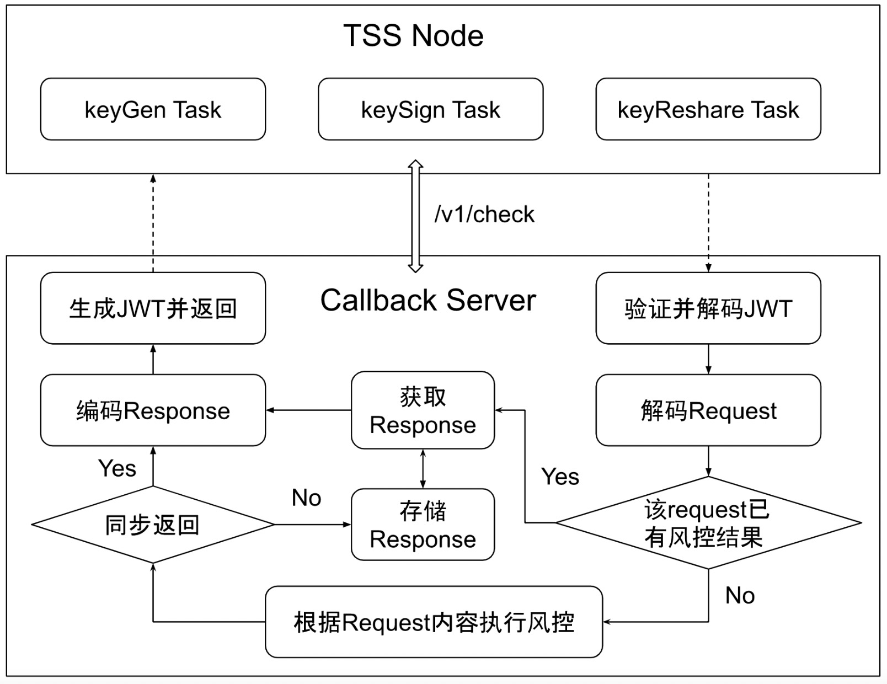

# cobo-mpc-callback-server-examples

## 声明
<B>本代码只是样例代码，仅供参考学习用，不建议直接当成工程代码使用，强烈建议您使用自己熟悉的代码框架来开发真正的风控回调服务。</B>

## 风控回调流程图

从上面的流程图我们可以知道，CallBack服务程序的主要工作包括：JWT解码、风控逻辑、JWT编码三大部分。

有关JWT的详细介绍，可以参考[JWT组织文档](https://jwt.io/introduction)。

有关JWT在CallBack服务、TSS Node端的使用配置，可以参考[Cobo官方文档](https://docs.google.com/document/d/1ifQMVqCSyc129OGq7AKo7t5QBBkkAeu9svLfX4lKPhI/edit#)。

在我们的样例代码中，也已经有了JWT解码和JWT编码相关的代码片段，在开发过程中可以直接借鉴。

风控逻辑部分的开发，是CallBack服务成功的关键。TSS Node将会把一些关键的风控信息传递到CallBack服务中，您需要根据这些信息，再配合实际业务的需求去实现自己的风控逻辑，这些关键的风控信息在Cobo的官方文档中也有具体的[描述](https://docs.google.com/document/d/1ifQMVqCSyc129OGq7AKo7t5QBBkkAeu9svLfX4lKPhI/edit#heading=h.slsc6no965uk)。

在我们提供的golang语言版本的样例中，实现了一个简单的风控白名单例子，您在实现自己的风控逻辑时也可以进行参考。

如果您的风控逻辑较为复杂，耗时较长，也可以参考我们提供的Java版本的例子。Java版本的例子在白名单风控的基础上，对风控结果进行了存储，实现了风控结果异步返回。
