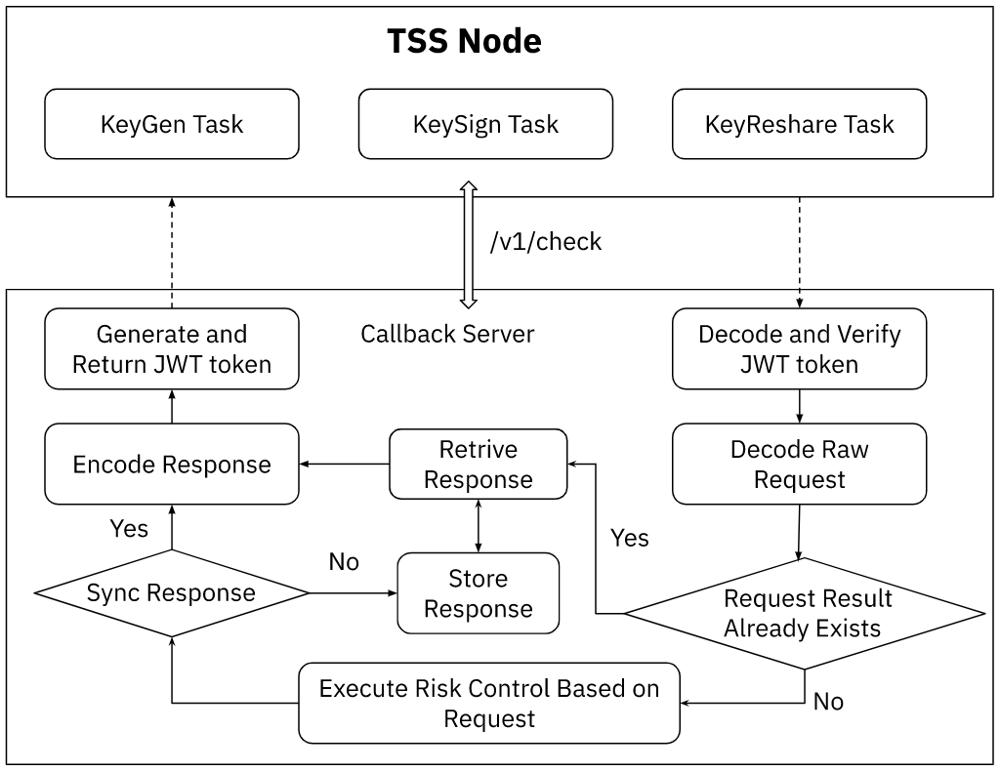

# cobo-mpc-callback-server-examples

## Disclaimer
<B> All code samples are for reference only. Clients are not recommended to use these samples directly as their source codes. We advise clients to use a code framework that aligns with its business requirements to develop the callback service. </B>

## Callback Flowchart

As shown on the flowchart, the callback service includes three main components: JWT decoding, rick control, and JWT encoding. 

For more information on JWT, please refer to [[Introduction to JSON Web Tokens](https://jwt.io/introduction)].

For more information on JWT configuration for Cobo MPC WaaS's callback service, please refer to [[TSS Node User Guide](https://docs.google.com/document/d/1J3tuFnv-jWm20-JoCQ1uYRhLYeU-IbqOyyCPHunbYr4/edit?usp=drive_web&ouid=105673697501568138532)].

The schemes for decoding and encoding JWT are also provided in the code samples, which can be used for reference during development. 

The risk control mechanism is a core component of Cobo MPC WaaS's callback service. The key information associated with risk control can be queried via the TSS Node and returned to the callback server. Clients need to utilize the information to realize a risk control mechanism that fits its security requirements. For more information on risk control, please refer to [[TSS Node User Guide](https://docs.google.com/document/d/1J3tuFnv-jWm20-JoCQ1uYRhLYeU-IbqOyyCPHunbYr4/edit?usp=drive_web&ouid=105673697501568138532)]. 

Clients can also refer to the Go language code samples to implement a risk control whitelist.

For clients with higher requirements for risk control, please refer to the Java language code samples. In addition to a risk control whitelist, the Java code samples also allow clients to store the risk control results queried via each callback request. 
